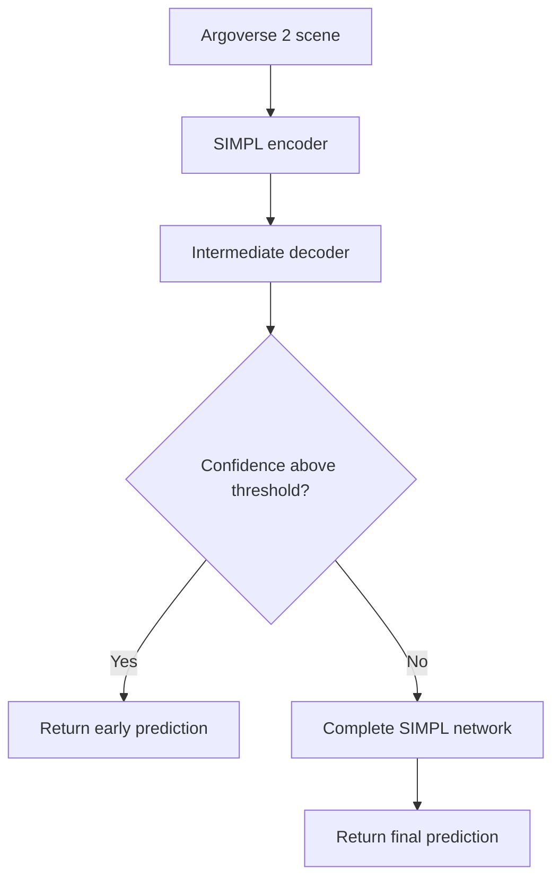

# Early-Exit Multi-Agent Motion Forecasting

A compute-adaptive extension of the pretrained SIMPL motion-forecasting model for the Argoverse 2 dataset.

This project introduces a confidence-gated intermediate exit into SIMPL, allowing high-confidence scenes to bypass the remaining decoder computation while more difficult scenes continue through the complete network. The objective is to reduce inference time while preserving motion-forecasting quality.

<p align="center">
  
</p>

## Project Overview

Modern motion-forecasting models generate multiple possible future trajectories for surrounding agents. Although deeper processing can improve predictions for difficult scenes, many comparatively simple scenes may not require the complete network.

This project investigates whether SIMPL can perform compute-adaptive inference through an early-exit mechanism.

The modified inference process is:

1. Process the scene using the pretrained SIMPL encoder.
2. Generate an intermediate trajectory prediction through an added early-exit decoder.
3. Estimate the confidence of the intermediate prediction.
4. Exit early when confidence exceeds a selected threshold.
5. Route lower-confidence scenes through the complete SIMPL network.

The original SIMPL architecture, preprocessing pipeline, and forecasting framework are retained as the baseline. The principal contribution of this project is the design, integration, and evaluation of the confidence-gated early-exit mechanism.

## Results

The early-exit model was evaluated on the Argoverse 2 validation set containing 22,019 scenes.

| Metric | Result |
|---|---:|
| Validation scenes | 22,019 |
| Scenes exiting early | 7.8% |
| End-to-end runtime reduction | 5.2% |
| minFDE<sub>K</sub> | 1.925 |
| Baseline Brier-FDE<sub>K</sub> | 2.561 |
| Early-exit Brier-FDE<sub>K</sub> | 2.559 |

Across five evaluated confidence thresholds, the selected configuration reduced end-to-end validation runtime by 5.2% while preserving the principal forecasting metrics. The Brier-FDE result changed from 2.561 for the baseline to 2.559 with early exiting.

These findings show that confidence-gated routing can avoid part of the model computation for most validation scenes without materially degrading forecasting quality.

## Architecture



The early-exit branch produces the same forecasting output structure expected by the existing SIMPL evaluation pipeline. This allows the modified model to be compared directly with the pretrained baseline using standard Argoverse 2 forecasting metrics.

## Dataset

The project uses the [Argoverse 2 Motion Forecasting Dataset](https://www.argoverse.org/av2.html), which contains 250,000 scenarios featuring:

- Historical trajectories for focal and surrounding actors
- High-definition map information
- Multiple interacting road users
- Six predicted trajectory modes
- A 60-step prediction horizon

Follow the official [Argoverse 2 setup instructions](https://argoverse.github.io/user-guide/getting_started.html) to download and configure the dataset.

## Getting Started

### 1. Create the environment

```bash
conda create --name early-exit-simpl python=3.8
conda activate early-exit-simpl
```

### 2. Install PyTorch

Install the PyTorch version compatible with your CUDA environment. The original SIMPL configuration uses PyTorch 1.12 and CUDA 11.6:

```bash
conda install pytorch==1.12.0 torchvision==0.13.0 \
    torchaudio==0.12.0 cudatoolkit=11.6 \
    -c pytorch -c conda-forge
```

### 3. Install Argoverse 2

```bash
pip install av2
```

For additional installation and dataset instructions, refer to the official [Argoverse 2 documentation](https://argoverse.github.io/user-guide/getting_started.html).

### 4. Install the remaining dependencies

```bash
pip install scikit-image IPython tqdm ipdb tensorboard
```

## Data Preparation

Configure the Argoverse 2 dataset path and run the corresponding preprocessing script from the `scripts/` directory.

The processed dataset should contain the actor-trajectory and HD-map features required by SIMPL. The original preprocessing and data-loading implementation is inherited from the SIMPL repository.

If the system raises the following error while loading scene files:

```text
OSError: [Errno 24] Too many open files
```

increase the file-descriptor limit:

```bash
ulimit -SHn 51200
ulimit -s unlimited
```

## Training and Evaluation

The early-exit decoder is trained on top of the SIMPL forecasting architecture. The repository supports:

- Training the added intermediate prediction branch
- Evaluating the original SIMPL baseline
- Evaluating confidence-gated early-exit inference
- Comparing runtime and forecasting accuracy
- Testing multiple confidence thresholds

Refer to the scripts under `scripts/` for the commands corresponding to Argoverse 2 training, baseline evaluation, and early-exit evaluation.

The principal evaluation metrics include:

- Minimum Average Displacement Error (`minADE_K`)
- Minimum Final Displacement Error (`minFDE_K`)
- Miss Rate (`MR_K`)
- Brier Minimum Final Displacement Error (`Brier-FDE_K`)
- End-to-end validation runtime
- Percentage of scenes routed through the early exit

## Experimental Design

Five confidence thresholds were evaluated to measure the tradeoff among:

- Early-exit rate
- Forecasting quality
- End-to-end runtime
- Additional computation introduced by the intermediate decoder

The confidence threshold determines how aggressively the model exits:

- A lower threshold allows more scenes to exit early.
- A higher threshold sends more scenes through the complete network.
- The selected threshold aims to reduce computation without meaningfully degrading prediction quality.

## Limitations

The observed runtime improvement is smaller than the early-exit rate because the intermediate branch is evaluated for every scene and only a portion of the full model computation is skipped. Runtime is also influenced by data loading, encoding, batching, GPU utilization, and evaluation overhead.

Therefore, the 98.2% early-exit rate should not be interpreted as a 98.2% reduction in runtime. The measured end-to-end runtime reduction was 5.2%.

Further improvements could include:

- Moving the exit point earlier in the architecture
- Reducing the intermediate decoder’s computational overhead
- Calibrating confidence scores
- Learning the exit policy jointly with the forecasting objective
- Evaluating the method under different batch sizes and hardware configurations
- Testing scene-aware or actor-aware exit policies

## Repository Structure

```text
Early-exit-motion-forecasting
├── data_argo/
├── files/
├── scripts/
├── simpl/
├── saved_models/
└── README.md
```

Directory names may differ depending on the local dataset and checkpoint configuration.

## Built On SIMPL

This work is an extension of:

> Lu Zhang, Peiliang Li, Sikang Liu, and Shaojie Shen,  
> “SIMPL: A Simple and Efficient Multi-agent Motion Prediction Baseline for Autonomous Driving,”  
> IEEE Robotics and Automation Letters, 2024.

- [Original SIMPL repository](https://github.com/HKUST-Aerial-Robotics/SIMPL)
- [SIMPL paper](https://arxiv.org/abs/2402.02519)
- [SIMPL video](https://youtu.be/_8-6ccopZMM)

The SIMPL model, its original training and preprocessing infrastructure, and portions of the repository structure originate from the authors’ public implementation. This project modifies that baseline to study confidence-gated early-exit inference.

## Acknowledgments

We thank the authors and maintainers of:

- [SIMPL](https://github.com/HKUST-Aerial-Robotics/SIMPL)
- [Argoverse 2](https://www.argoverse.org/av2.html)
- [LaneGCN](https://github.com/uber-research/LaneGCN)
- [HiVT](https://github.com/ZikangZhou/HiVT)
- [DSP](https://github.com/HKUST-Aerial-Robotics/DSP)

## License

This repository is derived from the original SIMPL implementation and remains subject to its [MIT License](https://github.com/HKUST-Aerial-Robotics/SIMPL/blob/main/LICENSE).
